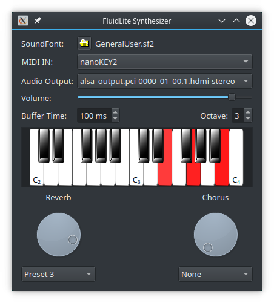

FluidLite MIDI Synthesizer for Qt
=================================

This project is a multiplatform real time MIDI Synth based on the FluidLite Synthesizer with Qt Multimedia audio output.

The library uses Drumstick::RT MIDI input and Qt audio output. Complete compile-time dependencies are:
* Qt5 or Qt6, including QtMultimedia. http://www.qt.io/
* Drumstick 2, for Drumstick::RT MIDI input and for Drumstick::Widgets piano component. http://sourceforge.net/projects/drumstick/

Just to clarify the Drumstick dependency: this project requires Drumstick::RT, but Drumstick does not depend on this project at all.

The project directory contains:
* cmdlnsynth: Command line sample program using the synthesizer library
* guisynth: GUI sample program using the synthesizer library
* libcommon: The synthesizer shared library, using Drumstick::RT and Qt Multimedia
* FluidLite: The FluidLite source files as a git submodule

Hacking
-------

Remember to use `git clone --recurse-submodules` when cloning the repository to populate the working copy with all the sources, including the submodule's.
If you forgot to do that, then you may need to `git submodule update --init --recursive` afterwards.

Use your favorite IDE or text editor with the source files. My preference is QtCreator: https://www.qt.io/ide/
To build, test and debug you may also find QtCreator interesting. You should use CMake (>= 3.14) to configure the project.

License
-------

Copyright (C) 2022-2023 Pedro López-Cabanillas.

This program is free software; you can redistribute it and/or modify
it under the terms of the GNU General Public License as published by
the Free Software Foundation; either version 3 of the License, or
(at your option) any later version.

This program is distributed in the hope that it will be useful,
but WITHOUT ANY WARRANTY; without even the implied warranty of
MERCHANTABILITY or FITNESS FOR A PARTICULAR PURPOSE.  See the
GNU General Public License for more details.

You should have received a copy of the GNU General Public License
along with this program. If not, see <http://www.gnu.org/licenses/>.

This project includes code from the FluidLite synthesizer.
